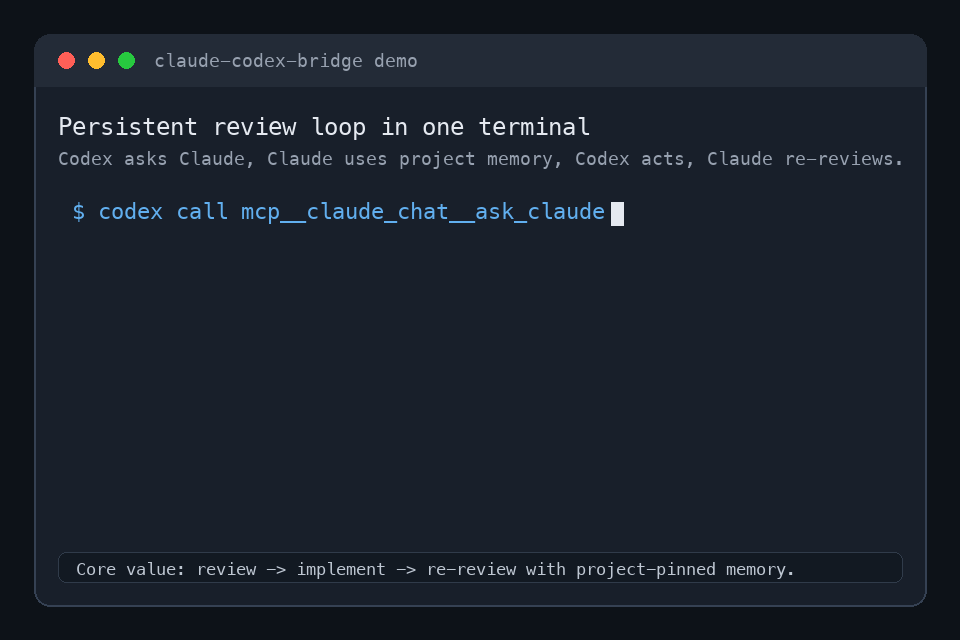

# claude-codex-bridge

> Let **Claude Code** and **Codex** call each other as tools — and make the Claude
> side a **persistent, project-aware colleague**, not a fresh stateless instance
> every call.

[](LICENSE)
[](https://modelcontextprotocol.io)
[](https://docs.claude.com/claude-code)
[](https://developers.openai.com/codex)


Windows is not yet verified; see
[`docs/windows-support.md`](docs/windows-support.md) for compatibility notes.

**Claude Code ↔ Codex, wired together through MCP and a durable shared board.**

This project was built with the same Claude + Codex collaboration workflow it
enables: one agent asks the other for review, execution, and second opinions,
while both coordinate through project-local shared files.

It is a collaboration framework for asymmetric agents: MCP is the transport,
`collaboration.md` is the shared memory, `collaboration_signal.json` is the cheap
change detector, and resource profiles keep quota, context, billing, and write
authority visible.



A small, dependency-free bridge over the [Model Context
Protocol](https://modelcontextprotocol.io). Each agent reaches the other with one
tool call; the Claude side keeps per-project memory and reads your shared
`collaboration.md` so the two agents actually work *together*.

## What you can do with it

- Ask Claude to review Codex's current implementation without leaving Codex.
- Ask Codex to run or inspect a task from Claude Code.
- Keep a persistent Claude colleague per project directory.
- Coordinate two agents through `collaboration.md` and a low-token signal file.
- Route Claude Max / Codex Pro style workflows by scarce reasoning vs. bounded execution.
- Run an event-driven collaboration loop with explicit caps and safety checks.
- Promote real reviewer/executor loops that converge to `status=done` without a
  human manually poking every turn.

See [`examples/review-loop.md`](examples/review-loop.md) for a copy-pasteable
workflow that demonstrates the core review → execute → re-review loop.
See [`examples/autonomous-review-loop.md`](examples/autonomous-review-loop.md)
for a real bounded autonomous review loop driven by the harness.
See [`examples/cookbook.md`](examples/cookbook.md) for review, test, docs, and
shared-board handoff prompts.
See [`docs/resource-aware-routing.md`](docs/resource-aware-routing.md) for the
full subscription, billing, context, and permission routing matrix, and
[`docs/role-presets.md`](docs/role-presets.md) for preset files you can apply
to `collaboration_state.json`. Future multi-CLI support is intentionally parked
behind [`docs/adapter-rfc.md`](docs/adapter-rfc.md); today this bridge supports
Claude Code + Codex.

```
   ┌──────────────┐   mcp__codex__codex          ┌──────────────┐
   │  Claude Code │ ───────────────────────────► │    Codex     │
   │    (you)     │      codex mcp-server         │              │
   │              │ ◄─────────────────────────── │              │
   └──────────────┘   mcp__claude_chat__ask_claude└──────────────┘
                                │
                                ▼
                  claude_chat_mcp.py  (claude -p)
                                │
                                ▼
            a Claude colleague that REMEMBERS (per-project session)
            and reads ./collaboration.md before answering
```

| Direction | Tool the caller uses | What runs under the hood |
| --- | --- | --- |
| Claude → Codex | `mcp__codex__codex` / `mcp__codex__codex-reply` | `codex mcp-server` (Codex's built-in MCP mode) |
| Codex → Claude | `mcp__claude_chat__ask_claude` | `claude_chat_mcp.py` → `claude -p` |

## Why a wrapper for the Claude side?

Codex ships an MCP server mode (`codex mcp-server`) that exposes a single "run a
Codex session" tool — perfect for Claude→Codex. Claude Code's built-in
`claude mcp serve`, however, exposes Claude's **individual tools** (Read, Bash,
Edit, …), not a "chat with Claude" endpoint, and its `Agent` tool has **no
sub-agents registered** in headless serve mode (`Available agents:` is empty). So
to let Codex *talk to a reasoning Claude*, this project wraps `claude -p`
(headless print mode) in a tiny MCP server. That wrapper is the mirror image of
`codex mcp-server`.

## The persistent "colleague" behavior

`ask_claude(prompt, session_id?, new_session?)`:

- **Memory, auto-pinned per directory.** The first call in a working directory
  creates a Claude session with a fixed id and stores it under
  `~/.claude-codex-bridge/sessions/`. Every later call from that directory
  auto-`--resume`s it, so the same Claude accumulates context — Codex never has
  to manage a session id. Pass `session_id` to target a specific one, or
  `new_session: true` to reset.
- **Project grounding.** Each call appends a system prompt telling Claude it is
  the project's collaborator and to read `./collaboration.md` if it exists.
- **Powers: read + write, no shell.** Runs with
  `--allowedTools Read Grep Glob Edit Write TodoWrite` and
  `--permission-mode acceptEdits`. No `Bash`. No MCP servers are loaded inside
  the spawned Claude (`--strict-mcp-config --mcp-config '{"mcpServers":{}}'`),
  which keeps startup fast and prevents it from recursing back into Codex.

> **What it is *not*:** a literal always-on process that sees messages typed into
> your interactive Claude window in real time. CLI agent sessions can't be
> injected into from outside. Persistent session + shared `collaboration.md` +
> on-demand reach gives you ~90% of "online colleague" without that.

## Prerequisites

- [Claude Code](https://docs.claude.com/claude-code) CLI (`claude`) — logged in
- [Codex](https://developers.openai.com/codex) CLI (`codex`) — logged in
- `python3` (standard library only; no pip installs)

## Install

> ⚠️ **Security, up front.** By default the Claude colleague can **read _and
> edit/write_ files** in whatever directory Codex calls it from, using your
> Claude credentials — i.e. Codex can drive file changes on your machine through
> Claude. Install read-only with `BRIDGE_READONLY=1 ./install.sh`, or scope it
> later via `CLAUDE_CHAT_ALLOWED_TOOLS`. There is no `Bash` access in either mode.
> See [`docs/read-only-setup.md`](docs/read-only-setup.md) for the safest
> evaluation setup and a redacted config check.

```bash
git clone https://github.com/jackcongmac/claude-codex-bridge.git
cd claude-codex-bridge
./install.sh                    # read + write colleague (default)
# BRIDGE_READONLY=1 ./install.sh  # read-only colleague
```

**Via npm (packaged; publish pending).** The package is built; once it's published
to npm this is the frictionless path — one artifact installs/updates BOTH halves:

```bash
npm install -g @jackcongus/claude-codex-bridge   # (after the package is published)
claude-codex-bridge install                      # wires up both MCP directions + the skill
npm update -g @jackcongus/claude-codex-bridge    # update (npm owns updates here)
```

(The package is scoped — `@jackcongus/claude-codex-bridge` — because the unscoped
name is taken by an unrelated project. The CLI command stays `claude-codex-bridge`.)

(`claude-codex-bridge update` / `scripts/bridge-update.sh` do a `git pull` — that's the
updater for the **git-clone** install above, not the npm one.) Until the package is
published, use the git clone.

The installer is idempotent. It:

1. Detects `python3`, `claude`, and `codex` (override the Claude path with
   `CLAUDE_BIN=/path/to/claude ./install.sh`).
2. Symlinks the wrapper into `~/.claude-codex-bridge/` (so `git pull` /
   `bridge-update` keeps it current; `BRIDGE_WRAPPER_COPY=1` forces a copy).
3. Adds `[mcp_servers.claude_chat]` to `~/.codex/config.toml` (backing up first),
   pinning the detected `claude` path via `CLAUDE_BIN`.
4. Registers Codex as a user-scope Claude MCP server (all projects), using the
   detected absolute `codex` path: `claude mcp add codex -s user -- "$CODEX_BIN" mcp-server`.

Then **restart Codex** so it loads the new server.

## Usage

In **Codex**:

```
call mcp__claude_chat__ask_claude with prompt:
"Read collaboration.md and give me your QA verdict on the current draft."
```

In **Claude Code**:

```
call mcp__codex__codex with prompt:
"Run the test suite and report failures."
# continue with mcp__codex__codex-reply using the returned threadId
```

Both directions are **global** after install — every project gets them, no
per-project setup.

## Coordination layer (the part that makes them *collaborate*)

The two MCP servers are the **transport** — the "phone line." They let each agent
call the other, but a phone line alone isn't teamwork. The coordination layer is
a simple, durable convention that turns two agents into colleagues:

- **`collaboration.md`** — a shared board in your project root: roles, operating
  rules, each agent's outbox, file locks, open questions, a decision log. Both
  agents read it before acting and write findings back to it. It's the **shared
  memory**; the `ask_claude` colleague is already told to read it automatically.
- **`collaboration_signal.json`** — a tiny **low-token signal file**. Instead of
  re-reading the whole board on every poll, an agent reads this first and only
  re-reads `collaboration.md` when `update_id` changes. Cheap polling.
- **`chat_delivery.json`** — responder delivery state for the group chat. The board
  remains the message truth; this file records which chat message ids each agent has
  handled so a restarted responder can replay missed @ messages with best-effort
  handled-id dedupe. Delivery is at-least-once: a crash after posting a reply but
  before recording handled state can re-answer that one message on restart.
- **`chat_typing.json`** — transient group-chat UX state. A responder writes
  `thinking` while Claude/Codex is generating a reply, and the web chat hides stale
  entries automatically if a responder dies before clearing them.

For the simplest "virtual chat board" in the current terminal, run:

```bash
scripts/bridge-chat.sh --self Jack --interactive
```

It posts to the same `## Chat` board thread, starts the Claude/Codex responders by
default, sends on Enter, and exits on `Esc` without opening a browser. The older
`--watch` mode remains read-only live tailing.

When the web group chat is open, it starts one responder for Claude and one for Codex
and lightly supervises them: if a responder process exits while the room is still open,
the server starts that responder again. This is scoped to the chat server lifetime; it
is not a full always-on watcher service.

Drop both into a project (idempotent, never overwrites existing files):

```bash
scripts/init-collaboration.sh           # into the current directory
scripts/init-collaboration.sh /path/to/project
```

For a fresh or restarted agent window, run the activation autostart first:

```bash
scripts/board-wait.sh --self Codex --project . &
scripts/bridge-autostart.sh --self Codex --peer Claude --project .
```

`board-wait` must be started by the agent/harness as the tracked background task;
its exit is what wakes the agent. `bridge-autostart` then performs the proactive handshake:
it joins the board, starts liveness, runs `bridge-handshake`, and reports
GO/NO-GO. A NO-GO leaves a board invite for the peer and prints the exact fix, but it
is non-blocking for work that does not require a peer handoff.

For a manual fallback, bring only the liveness side online with:

```bash
scripts/bridge-live.sh --self Codex --project .
```

`bridge-live` registers you on the board, starts one `presence-keepalive`
process if needed, prints the current liveness report, and gives you the exact
`board-wait` command to run in the background. It deliberately does not own
`board-wait`: that one-shot watcher exits to wake the agent, so the agent must
re-arm it after each turn.

The loop:

1. Each agent reads `collaboration_signal.json`; re-reads `collaboration.md` only
   when `update_id` changed.
2. Each posts status / findings to **its own outbox** via
   `scripts/bridge-post.sh --self <You> --message "…"` — one **locked** step that
   appends to the board AND bumps `collaboration_signal.json`. (Don't hand-edit the
   board and bump the signal separately — that lock-free pattern can lose updates.)
3. Use the MCP bridge to **poke the other agent to take a turn**.

> Transport (global, installed once) vs. coordination (per-project files you drop
> in). The bridge gives you both halves; the board is what makes a review →
> execute → re-review loop actually work.

Check whether the joined agents are alive without mistaking the normal
`board-wait` re-arm gap for a dead peer:

```bash
scripts/bridge-liveness.sh report --self Codex --project .
scripts/bridge-liveness.sh report --self Codex --project . --json
```

`LIVE` means the agent is present and currently armed. `PRESENT` means the
heartbeat is fresh but the one-shot watcher is between wake and re-arm. `STALE`,
`DEAD`, and `DEPARTED` mean the heartbeat is aging, expired, or explicitly marked
departed.

## Autonomous mode (event-driven, no manual poke)

Manual mode needs a human to invoke each turn. Autonomous mode runs the loop
itself: a lightweight watcher fires a headless agent turn whenever the *other*
agent commits. Idle cost is ~0 (a file watcher / mtime poll — no tokens until
there's real work).

```bash
# one per side (two shells / two machines); read-only by default
scripts/watch-collaboration.sh --as claude --project .
scripts/watch-collaboration.sh --as codex  --project .   # add --allow-write to let it edit files
```

`collaboration_state.json` is the authoritative control state (ships **paused**).
To start the loop, set `status:"active"` and `next_actor` to whichever agent
moves first, then bump `collaboration_signal.json`. Watch it live:

```bash
scripts/bridge-status.py --project . --watch  # state, routing, caps, recent events
tail -f collaboration_auto.log                # raw JSONL events
```

How a turn is made safe (all in `_auto_turn.py`, not left to the model):

- **Whose turn:** a turn runs only if `next_actor == self`, the signal's
  `update_id` is newer than this watcher's high-water mark, and `status=="active"`.
- **Draft → commit-under-lock:** the model only returns a JSON draft; the harness
  takes a global lock, re-checks `update_id` (CAS), then writes the board, state,
  and signal (signal last = commit marker). Two agents can't write concurrently.
- **Bounded & safe:** `max_turns` caps the loop; any anomaly (timeout, CAS
  conflict, corrupt JSON, bad draft) halts to `awaiting_human` and notifies — it
  never silently drops or loops away your budget.

Caps & safety knobs (in `collaboration_state.json`, or `--max-turns`/`--max-cost`
on the watcher):

| Knob | Effect |
| --- | --- |
| `status` | `active` runs; `paused`/`done`/`awaiting_human` stop the loop |
| `max_turns` | hard cap on total turns (governs **both** sides) |
| `max_cost_usd` | USD cap — **Claude side only**; `codex exec` cost isn't parsed, so the Codex side is governed by `max_turns` |
| `--allow-write` | lets that side edit project files (default: read-only, no Bash) |

Kill switch: Ctrl-C the watcher, or set `status:"paused"`/`"done"`.

### Resource-aware routing

Autonomous mode is not meant to alternate turns blindly. The default templates
include `resource_profiles` for a `max-claude-pro-codex` style split:

- Claude Max handles high-leverage reasoning, architecture, strict review, test
  strategy, and final QA.
- Codex Pro handles bounded implementation, search, small fixes, test iteration,
  and mechanical docs updates.

`scripts/bridge-status.py --project .` displays the current roles, resource
profiles, turn caps, cost cap, last signal, recent events, and halt reason. See
[`docs/resource-aware-routing.md`](docs/resource-aware-routing.md) for the
routing rules.

Apply an opinionated role preset when you want the state file to reflect that
split explicitly:

```bash
scripts/apply-role-preset.py --project . --preset max-claude-pro-codex
scripts/apply-role-preset.py --project . --preset reviewer-implementer
```

Presets reuse the existing `roles` and `resource_profiles` fields; they do not
grant extra write permissions. Apply them while the loop is paused; the command
refuses `status:"active"` or an existing `collaboration.lock` unless `--force`
is passed. See [`docs/role-presets.md`](docs/role-presets.md).

## Configuration (env vars on the Codex `claude_chat` server)

| Variable | Default | Purpose |
| --- | --- | --- |
| `CLAUDE_BIN` | auto-detected | path to the `claude` CLI |
| `CLAUDE_CHAT_SESSION_DIR` | `~/.claude-codex-bridge/sessions` | pinned-session store |
| `CLAUDE_CHAT_TIMEOUT` | `900` | per-call timeout (seconds) |
| `CLAUDE_CHAT_ALLOWED_TOOLS` | `Read Grep Glob Edit Write TodoWrite` | tool allowlist for the colleague |

To make the colleague read-only, set
`CLAUDE_CHAT_ALLOWED_TOOLS="Read Grep Glob"`. To give it shell access, add
`Bash` (understand the risk: Codex could then drive arbitrary commands on your
machine through Claude).
See [`docs/read-only-setup.md`](docs/read-only-setup.md) for a safe setup guide.

## Gotcha that will bite you if you reimplement this

An MCP stdio server **must not** read its input with `for line in sys.stdin`.
On a pipe, Python block-buffers that iterator (it waits to fill ~8 KB before
yielding a line), so a lone `initialize` message never reaches your handler and
the MCP client hangs forever. It looks like it works when you feed several
messages at once in a test, then mysteriously hangs against a real client that
sends one message and waits. Use `while True: line = sys.stdin.readline()`
instead — it returns as soon as a newline arrives.

## Security notes

- The spawned Claude runs with **your** Claude Code credentials and can read (and
  by default edit) files in the working directory. Scope `CLAUDE_CHAT_ALLOWED_TOOLS`
  to your comfort level.
- Never commit your real `~/.codex/config.toml` — it may contain API keys for
  other MCP servers. This repo only ships a config *template* via the installer.

## License

MIT — see [LICENSE](LICENSE).
